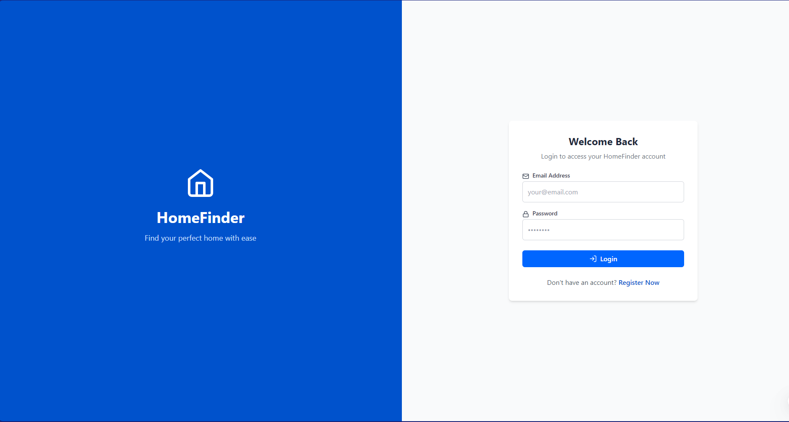
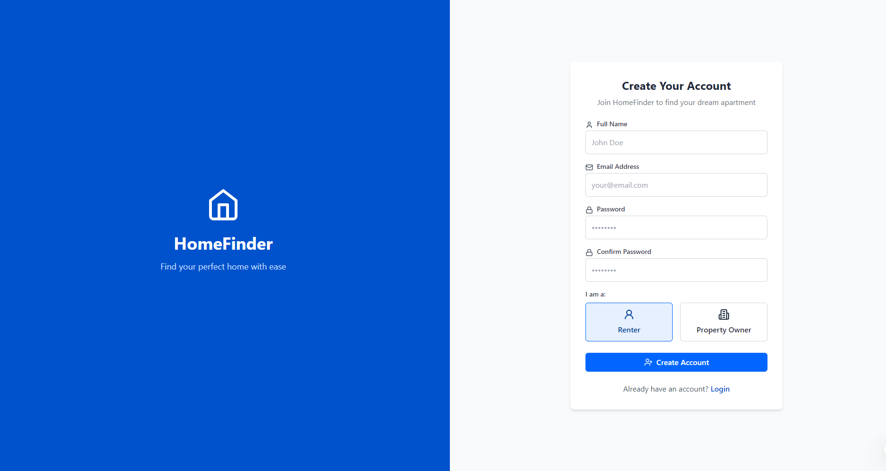
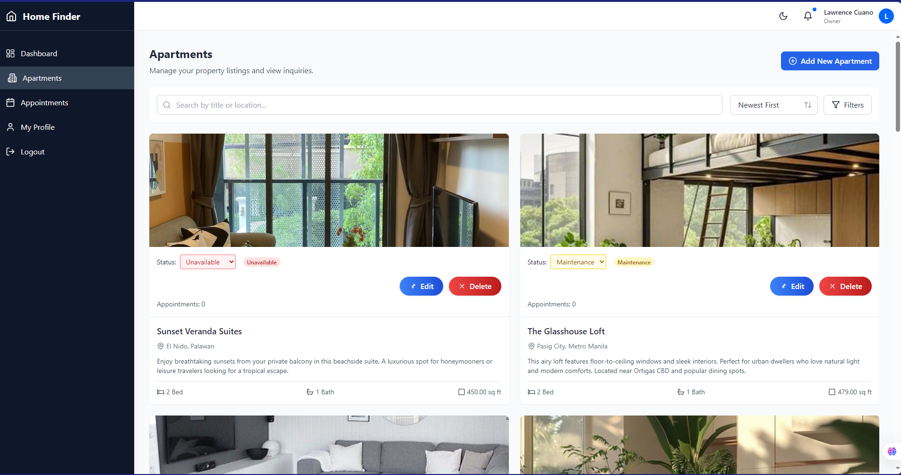
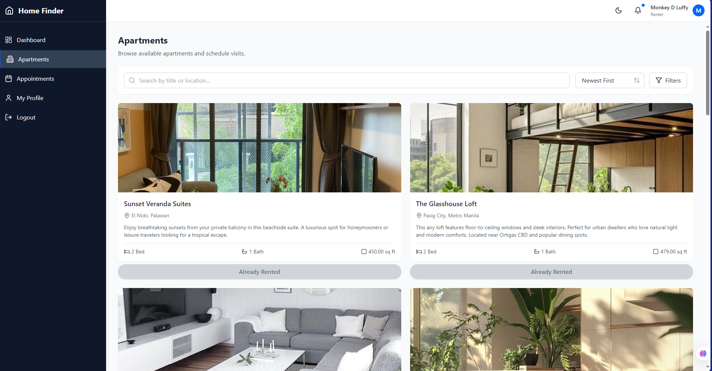

# HomeFinder - Apartment Appointment Scheduling System

HomeFinder is a full-stack web application that streamlines the process of listing, searching, and scheduling appointments for apartments. It is designed for both property owners and renters, providing role-based dashboards, analytics, and a modern, responsive user experience.

---

## Features

### General
- **Role-based Authentication**: Secure JWT authentication with support for property owners, renters, and admin roles.
- **Responsive Design**: Works seamlessly on desktop, tablet, and mobile devices.
- **Modern UI/UX**: Built with React, TypeScript, and Tailwind CSS for a clean and intuitive interface.
- **Error Handling & Notifications**: User-friendly error messages and toast notifications.

### For Property Owners
- **Apartment Management**: Add, edit, and delete apartment listings, including uploading multiple images per property.
- **Dashboard Analytics**: View stats such as total apartments, total appointments, upcoming appointments, and total unique visitors.
- **Appointment Management**: Confirm, complete, or cancel viewing appointments.
- **Quick Actions**: Access to add new properties, manage appointments, and view analytics directly from the dashboard.

### For Renters
- **Apartment Browsing**: Search and filter apartments by location, price, bedrooms, and more.
- **Appointment Scheduling**: Book, reschedule, or cancel viewing appointments.
- **Saved & Recently Viewed Apartments**: Track favorite and recently viewed apartments for easy access.
- **Dashboard Analytics**: View scheduled visits, completed visits, saved apartments, and more.
- **Popular Apartments**: See apartments that are most frequently rented.

### Admin (optional/future)
- **User Management**: Manage users and roles.
- **System Analytics**: View overall system statistics.

---

## Project Structure

The project is organized into two main folders:

```
Home-Finder/
│
├── backend/      # Node.js Express API, database, and business logic
└── frontend/     # React + TypeScript client application
```

### Frontend

- **Framework**: React + TypeScript
- **Styling**: Tailwind CSS
- **Routing**: React Router
- **State Management**: React Context API (for authentication)
- **API Communication**: Axios
- **Components**: Modular and reusable, with separation for layout, pages, and UI elements.

### Backend

- **Framework**: Node.js with Express
- **Database**: MySQL (via XAMPP, or any MySQL server)
- **Authentication**: JWT-based, with middleware for role checks
- **File Uploads**: Multer for handling apartment images
- **API Structure**: RESTful endpoints for authentication, apartments, appointments, and dashboard analytics

---

## Getting Started

### Prerequisites

- **Node.js** (v14 or higher)
- **npm** (v7 or higher)
- **XAMPP** (for MySQL database) or any running MySQL server

### Installation

1. **Clone the repository**
   ```bash
   git clone https://github.com/mcrence/Home-Finder.git
   cd Home-Finder
   ```

2. **Install dependencies for both frontend and backend**
   ```bash
   npm run install:all
   ```

3. **Set up the database**
   - Start XAMPP and ensure MySQL is running
   - Create a database named `homefinder`
   - The backend will automatically create the required tables on first run

4. **Configure environment variables**
   - Copy `backend/.env.example` to `backend/.env`
   - Update the values as needed (DB credentials, JWT secret, etc.)

5. **Start the development servers**
   ```bash
   npm run dev:backend
   npm run dev:frontend
   ```
   - Frontend: [http://localhost:3000](http://localhost:3000)
   - Backend: [http://localhost:5000](http://localhost:5000)

---

## Database Connection

- Connection is managed in `backend/src/config/database.js`.
- Update `.env` with your MySQL credentials:
  ```
  DB_HOST=localhost
  DB_USER=root
  DB_PASSWORD=
  DB_NAME=homefinder
  ```
- The backend auto-creates all necessary tables on startup.

---

## API Endpoints

### Authentication
- `POST /api/auth/register` - Register a new user (owner or renter)
- `POST /api/auth/login` - Login and receive JWT
- `GET /api/auth/profile` - Get current user profile
- `PUT /api/auth/profile` - Update user profile
- `PUT /api/auth/change-password` - Change user password

### Apartments
- `GET /api/apartments` - Get all apartments (public/renter)
- `GET /api/apartments/:id` - Get apartment by ID
- `POST /api/apartments` - Create new apartment (**owners only**)
- `PUT /api/apartments/:id` - Update apartment (**owners only**)
- `DELETE /api/apartments/:id` - Delete apartment (**owners only**)
- `GET /api/apartments/owner/properties` - Get apartments owned by the current owner
- `GET /api/apartments/popular` - Get popular/recently rented apartments (for renters)
- `GET /api/apartments/rented-by-me` - Get apartments recently rented by the current renter

### Appointments
- `GET /api/appointments` - Get appointments for the current user
- `POST /api/appointments` - Create a new appointment (renter schedules viewing)
- `PATCH /api/appointments/:id` - Update appointment status (confirm, complete, cancel, reschedule)
- `DELETE /api/appointments/:id` - Delete a pending appointment

### Dashboard
- `GET /api/dashboard` - Get dashboard stats and recent activity for the current user (role-based)

---

## User Roles

| Role           | Capabilities                                                                 |
|----------------|------------------------------------------------------------------------------|
| **Owner**      | Manage apartments, view and manage appointments, see analytics               |
| **Renter**     | Browse/search apartments, schedule/cancel/reschedule appointments, save/view |


---

## Screenshots

### Login


### Registration


### Apartment Owner


### Apartment Renter



